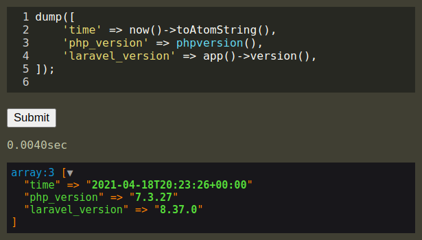

A rudimentary UI and backend for evaluating PHP remotely.
For debugging purposes only.

## Installation

    composer require vbarbarosh/laravel-debug-eval

## Usage in Laravel

    Route::any('/laravel-debug-eval', function () {
        // 1. Ensure that current user has access to this endpoint
        return vbarbarosh\laravel_debug_eval();
    });

## Credits

* Right pannel with a list of snippets was expired by https://github.com/tinkerun/tinkerun
